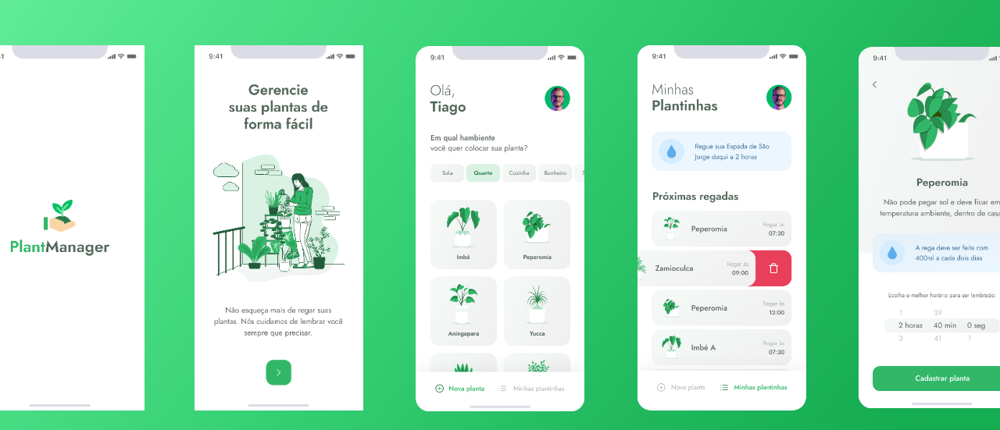

  
  <h1>PlantManager</h1>
  
🌱 Remind you to water your plants 🌱

  

    
                 
  

#About

Car your plants, NLW5 PROJECT!!

   

 
 

# Technologies

  - [Node.js](https://nodejs.org/en/)
  - [Expo](https://expo.io/)  
  - [React Native](https://reactnative.dev/)
  - [TypeScript](https://www.typescriptlang.org/)
  - [ESlint](https://eslint.org/)
  - [Prettier](https://prettier.io/)
  - [EditorConfig](https://editorconfig.org/)

### Requirements

- [Node.js](https://nodejs.org/en/)
- [Expo](https://expo.io/)  
- [Yarn](https://classic.yarnpkg.com/) or [NPM](https://www.npmjs.com/)

 

## License

This project is licensed under the MIT License - see the [LICENSE](LICENSE) file for details.

  Copyright © 2021-present, rafaelkenedy.

